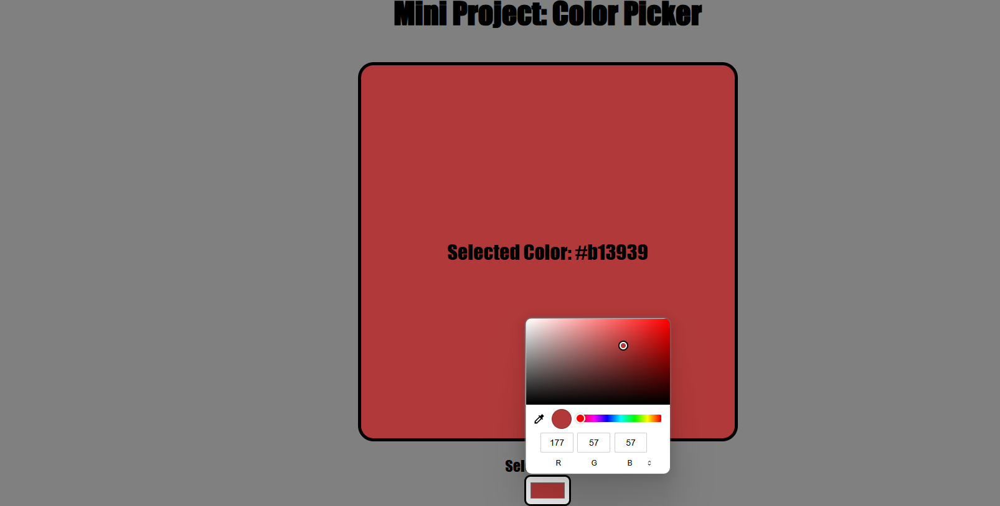

## 🌈 Color Picker Project:

- A simple and interactive color picker that allows users to choose a color and see its HEX code displayed in real-time.

## 😧 Features:
- 🎨 Live Color Preview: The selected color is displayed in a large box.
- 🏷️ HEX Code Display: Shows the corresponding HEX color code.
- 🎛 User-Friendly Interface: Easy-to-use color input.
- 🖌 Instant Updates: Changes the display dynamically as the user picks a color.

##  📸 Screenshot: 
- 

##  🌍 LIVE DEMO:
- Try it Out: https://chrisw0987.github.io/color-picker/

## 🛠 Tech Stack:
- **Frontend:** React.js, Vite
- **Styling:** CSS, Animations
- **Tools**: GitHub, VS Code


## 📦 Installation:
1. Clone the repository:
   ```bash
   git clone https://chrisw0987.github.io/color-picker/
2. cd color-picker
3. npm install
4. npm run dev